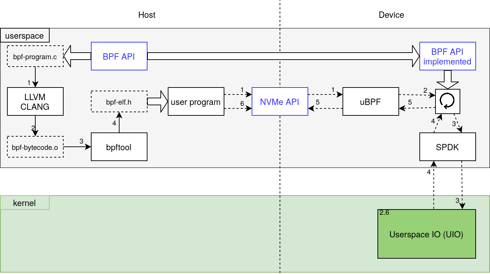

# ZCSD

ZCSD is a full stack prototype to execute eBPF programs as if they are
running on a Zoned Namespace (ZNS) SSD Computational Storage Device (CSD). The
entire prototype can be run from userspace by utilizing existing technologies
such as SPDK and uBPF. Since consumer ZNS SSDs are still unavailable, QEMU can
be used to create a virtual ZNS SSD.



## Getting Started

To get started using ZCSD perform the steps described in the [Setup](#setup)
section, followed by the steps in [Usage Examples](#usage-examples).

### Index

* [Directory structure](#directory-structure)
* [Modules](#modules)
* [Dependencies](#dependencies)
* [Setup](#setup)
* [Running & Debugging](#running-debugging)
  * [Environment](#environment)
  * [Usage Examples](#usage-examples)
  * [Debugging on Host](#debugging-on-host)
  * [Debugging on QEMU](#debugging-on-qemu)
* [CMake Configuration](#cmake-configuration)
* [Licensing](#licensing)
* [References](#references)
* [Snippets](#snippets)

### Directory structure

* qemu-csd - project source files
* cmake - small cmake snippets to enable various features
* dependencies - project dependencies
* docs - doxygen generated source code documentation
* documentation - project report written in LaTeX
* [playground]([playground/README.md]) - small toy examples or other experiments
* presentation - midterm presentation written in LaTeX
* [python](python/README.md) - python scripts to aid in visualization or measurements
* scripts - Shell scripts primarily used by CMake to install project dependencies
* tests - unit tests and possibly integration tests
* .vscode - Launch targets and settings to debug programs runnings inside QEMU over SSH 

### Modules

| Module       | Task                                                  |
|--------------|-------------------------------------------------------|
| arguments    | Parse commandline arguments to relevant components    |
| bpf_helpers  | Headers to define functions available from within BPF |
| bpf_programs | BPF programs ready to run on a CSD using bpf_helpers  |
| nvm_csd      | Emulated additional NVMe commands to enable BPF CSDs  |
| spdk_init    | Provides SPDK initialization and handles for nvm_csd  |

### Dependencies

This project requires quite some dependencies, the
majority will be compiled by the project itself and installed
into the build directory. Anything that is not automatically
compiled and linked is shown below. Note however, **these dependencies
are already installed on the image used with QEMU**.

* General
    * Linux 5.5 or higher
    * compiler with c++17 support
    * clang 10 or higher
    * cmake 3.18 or higher
    * python 3.x
    * mesonbuild (`pip3 install meson`)
    * pyelftools (`pip3 install pyelftools`)
    * ninja
    * cunit
* Documentation
    * doxygen
    * LaTeX
* Code Coverage
    * ctest
    * lcov
    * gcov
    * gcovr
* Continuous Integration
    * valgrind
* Python scripts
    * virtualenv

The following dependencies are automatically compiled. Dependencies are preferably
linked statically due to the nature of this project. However, for several dependencies
this is not possible due to various reason. For Boost, it is because the unit test
framework can not be statically linked (easily):

| Dependency                                                         | Version                                                       |
|--------------------------------------------------------------------|---------------------------------------------------------------|
| [backward](https://github.com/bombela/backward-cpp)                | 1.6                                                           |
| [booost](https://www.boost.org/)                                   | 1.74.0                                                        |
| [bpftool](https://github.com/Netronome/bpf-tool)                   | 5.10                                                          |
| [dpdk](https://www.dpdk.org/)                                      | 20.11.0                                                       |
| [generic-ebpf](https://github.com/generic-ebpf/generic-ebpf)       |                                                               |
| [libbpf](https://github.com/libbpf/libbpf)                         | 0.5                                                           |
| [libbpf-bootstrap](https://github.com/libbpf/libbpf)               |                                                               |
| [linux](https://www.kernel.org/)                                   | 5.10                                                          |
| [spdk](https://github.com/spdk/spdk)                               | 21.07                                                         |
| [isa-l](https://github.com/intel/isa-l)                            | spdk-v2.30.0                                                  |
| [qemu](https://www.qemu.org/)                                      | [nvme-next d79d797b0d](git://git.infradead.org/qemu-nvme.git) |
| [uBPF](https://github.com/iovisor/ubpf)                            |                                                               |

### Setup

Building tools and dependencies is done by simply executing the following commands
from the root directory. For a more complete list of cmake options see the
[Configuration](#configuration) section.

This first section of commands generates targets for host development. Among
these is compiling and downloading an image for QEMU. Many parts of this project
can be developed on the host but some require being developed on the guest. See
the next section for on guest development.

Navigate to the root directory of the project before executing the
following instructions. These instructions will compile the dependencies on the
host, these include an out-of-tree version of QEMU.

```shell script
git submodule update --init
mkdir build
cd build
cmake ..
cmake --build .
# Do not use make -j $(nproc), CMake is not able to solve concurrent dependency chain
cmake .. # this prevents re-compiling dependencies on every next make command
source qemu-csd/activate
# run commands and tools as you please for host based development
deactivate
```

From the root directory execute the following commands for the one time
deployment into the QEMU guest. These command assume the previous section of
commands has successfully been executed. The QEMU guest will automatically start
an SSH server reachable on port 7777. Both the _arch_ and _root_ user can be
used to login. In both cases the password is _arch_ as well. By default the QEMU
script will only bind the guest ports on localhost to reduce security concerns
due to these basic passwords.

```shell script
git bundle create deploy.git HEAD
cd build/qemu-csd
source activate
qemu-img create -f raw znsssd.img 16777216
# By default qemu will use 4 CPU cores and 8GB of memory
./qemu-start.sh
# Wait for QEMU VM to fully boot... (might take some time)
rsync -avz -e "ssh -p 7777" ../../deploy.git arch@localhost:~/
# Type password (arch)
ssh arch@localhost -p 7777
# Type password (arch)
git clone deploy.git qemu-csd
rm deploy.git
cd qemu-csd
git -c submodule."dependencies/qemu".update=none submodule update --init
mkdir build
cd build
cmake -DENABLE_DOCUMENTATION=off -DIS_DEPLOYED=on ..
# Do not use make -j $(nproc), CMake is not able to solve concurrent dependency chain
cmake --build .
```

Optionally, if the intend is to develop on the guest and commit code, the git 
remote  can be updated. In that case it also best to generate an ssh keypair, be
sure to start an ssh-agent as well as this needs to be performed manually on
Arch. The ssh-agent is only valid for as long as the terminal session that
started it. Optionally, it can be included in `.bashrc`.

```shell script
git remote set-url origin git@github.com:Dantali0n/qemu-csd.git
ssh-keygen -t rsa -b 4096
eval $(ssh-agent) # must be done after each login
ssh-add ~/.ssh/NAME_OF_KEY
```

Additionally, any python based tools and graphs are generated by execution these
additional commands from the root directory. Ensure the previous environment has
been deactivated.

```shell script
virtualenv -p python3 python
cd python
source bin/activate
pip install -r requirements.txt
```

### Running & Debugging

Running and debugging programs is an essential part of development. Often,
barrier to entry and clumsy development procedures can severely hinder
productivity. Qemu-csd comes with a variety of scripts preconfigured to reduce
this initial barrier and enable quick development iterations.

#### Environment:
Within the build folder will be a `qemu-csd/activate` script. This script can be
sourced using any shell `source qemu-csd/activate`. This script configures
environment variables such as `LD_LIBRARY_PATH` while also exposing an essential
sudo alias: `ld-sudo`.

The environment variables ensure any linked libraries can be found for targets
compiled by Cmake. Additionally, `ld-sudo` provides a mechanism to start targets
with  sudo privileges while retaining these environment variables. The
environment can be deactivated at any time by executing `deactivate`.

#### Usage Examples:

TODO: Generate integer data file, describe qemucsd and spdk-native applications,
usage parameters, relevant code segments to write your own BPF program, relevant
code segments to extend the prototype.

#### Debugging on host:
For debugging, several mechanisms are put in place to simplify this process.
Firstly, vscode launch files are created to debug applications even though the
require environmental configuration. Any application can be launched using the
following set of commands:

```shell
source qemu-csd/activate
# For when the target does not require sudo
gdbserver localhost:2222 playground/play-boost-locale
# For when the target requires sudo privileges
ld-sudo gdbserver localhost:2222 playground/play-spdk
```

Note, that when QEMU is running the port _2222_ will be used by QEMU instead.
The launch targets in `.vscode/launch.json` can be easily modified or extended.

When gdbserver is running simply open vscode and select the root folder of
qemu-csd, navigate to the source files of interest and set breakpoints and
select the launch target from the dropdown (top left). The debugging panel in
vscode can be accessed quickly by pressing _ctrl+shift+d_.

Alternative debugging methods such as using gdb TUI or
[gdbgui](https://www.gdbgui.com/) should work but will require more manual
setup.

#### Debugging on QEMU:
Debugging on QEMU is similar but uses different launch targets in vscode. This
target automatically logs-in using SSH and forwards the gdbserver connection.

More native debugging sessions are also supported. Simply login to QEMU and
start the gdbserver manually. On the host connect to this gdbserver and set up
`substitute-path`.

On QEMU:
```shell
# from the root of the project folder.
cd  build
source qemu-csd/activate
ld-sudo gdbserver localhost:2000 playground/play-spdk
```

On host:
```shell
gdb
target remote localhost:2222
set substitute-path /home/arch/qemu-csd/ /path/to/root/of/project
```

More detailed information about development & debugging for this project can be
found in the report.

### CMake Configuration

This section documents all configuration parameters that the CMake project
exposes and how they influence the project. For more information about the
CMake project see the report generated from the documentation folder. Below 
all parameters are listed along their default value and a brief description.

| Parameter            | Default | Use case                                         |
|----------------------|---------|--------------------------------------------------|
| ENABLE_TESTS         | ON      | Enables unit tests and adds tests target         |
| ENABLE_CODECOV       | OFF     | Produce code coverage report \w unit tests       |
| ENABLE_DOCUMENTATION | ON      | Produce code documentation using doxygen & LaTeX |
| ENABLE_PLAYGROUND    | OFF     | Enables playground targets                       |
| ENABLE_LEAK_TESTS    | OFF     | Add compile parameter for address sanitizer      |
| IS_DEPLOYED          | OFF     | Indicate that CMake project is deployed in QEMU  |

For several parameters a more in depth explanation is required, primarily
_IS_DEPLOYED_. This parameter is used as the Cmake project is both used to
compile QEMU and configure it as well as compile binaries to run inside QEMU. As
a results, the CMake project needs to be able to identify if it is being
executed outside of QEMU or not. This is what _IS_DEPLOYED_ facilitates.
Particularly, _IS_DEPLOYED_ prevents the compilation of QEMU from source.

### Licensing

This project is available under the MIT license, several limitations apply
including:
  
* Source files with an alternative author or license statement other than Dantali0n and MIT respectively.
* Images subject to copyright or usage terms, such the VU and UvA logo.
* CERN beamer template files by Jerome Belleman.
* Configuration files that can't be subject to licensing such as `doxygen.cnf`
  or `.vscode/launch.json`

### References

* [SPDK](https://spdk.io/)
* [Zoned storage ZNS SSDs introduction](https://zonedstorage.io/introduction/zns/)
* [Getting started with ZNS in QEMU](https://www.snia.org/educational-library/getting-started-nvme-zns-qemu-2020)
* [NVMe ZNS command set 1.0 ratified TP](https://nvmexpress.org/wp-content/uploads/NVM-Express-1.4-Ratified-TPs-1.zip)
* [libnvme presentation](https://www.usenix.org/sites/default/files/conference/protected-files/vault20_slides_busch.pdf)
* BPF
  * Linux Kernel related
    * [Linux bpf manpage](https://www.man7.org/linux/man-pages/man2/bpf.2.html)
    * [BPF kernel documentation](https://www.kernel.org/doc/Documentation/networking/filter.txt)
  * BPF-CO-RE & BTF
    * [Linux BTF documentation](https://www.kernel.org/doc/html/latest/bpf/btf.html)
    * [BPF portability and CO-RE](https://facebookmicrosites.github.io/bpf/blog/2020/02/19/bpf-portability-and-co-re.html)  **Highly Recommended Read**
  * libbpf / standalone related
    * [BCC to libbpf conversion](https://facebookmicrosites.github.io/bpf/blog/2020/02/20/bcc-to-libbpf-howto-guide.html)
    * [Cilium BPF + XDP reference guide](https://docs.cilium.io/en/v1.9/bpf/) **Highly Recommended Read**
    * bpf_load
      * [Linux Observability with BPF](https://www.oreilly.com/library/view/linux-observability-with/9781492050193/)
    * bpf-bootstrap
      * [Building BPF applications with libbpf-bootstrap](https://nakryiko.com/posts/libbpf-bootstrap/)
  * userspace BPF execution / interpretation
    * [uBPF](https://github.com/iovisor/ubpf)
    * [generic-ebpf](https://github.com/generic-ebpf/generic-ebpf)
  * Various
    * [BTF sysfs vmlinux ABI](https://www.kernel.org/doc/Documentation/ABI/testing/sysfs-kernel-btf)
    * [BPF features and minimal kernel versions](https://github.com/iovisor/bcc/blob/master/docs/kernel-versions.md)
    * [BPF Performance Tools (Chapters 1, 2, 17.1, 17.5, 18)](http://www.brendangregg.com/bpf-performance-tools-book.html)
    * [eBPF release artile lwn.net](https://lwn.net/Articles/603983/)
    * [Why pingCAP switched from BCC to libbpf](https://pingcap.com/blog/why-we-switched-from-bcc-to-libbpf-for-linux-bpf-performance-analysis)
* Repositories / Libraries
  * [uNVME](https://github.com/OpenMPDK/uNVMe)
  * [SPDK](https://github.com/spdk/spdk)
* Patchsets
  * [ZNS SSD QEMU patch v11](http://patchwork.ozlabs.org/project/qemu-devel/list/?series=219344)
  * [ZNS SSD QEMU patch v2](https://patchwork.kernel.org/project/qemu-devel/cover/20200617213415.22417-1-dmitry.fomichev@wdc.com/)

### Snippets

* SPDK -> now supports ZNS zone append
* uNVME
* OCSSD
* RMDA
* libbpf (standalone)
* libbpf-tools (BCC)
* Linux Kernel:
  * p2pdma 
  * ioctl

Configuration and parameters for QEMU ZNS SSDs:
```shell
Usage:
      -device nvme-subsys,id=subsys0
      -device nvme,serial=foo,id=nvme0,subsys=subsys0
      -device nvme,serial=bar,id=nvme1,subsys=subsys0
      -device nvme,serial=baz,id=nvme2,subsys=subsys0
      -device nvme-ns,id=ns1,drive=<drv>,nsid=1,subsys=subsys0  # Shared
      -device nvme-ns,id=ns2,drive=<drv>,nsid=2,bus=nvme2

nvme options:
  addr=<int32>           - Slot and optional function number, example: 06.0 or 06 (default: -1)
  aer_max_queued=<uint32> -  (default: 64)
  aerl=<uint8>           -  (default: 3)
  cmb_size_mb=<uint32>   -  (default: 0)
  discard_granularity=<size> -  (default: 4294967295)
  drive=<str>            - Node name or ID of a block device to use as a backend
  failover_pair_id=<str>
  logical_block_size=<size> - A power of two between 512 B and 2 MiB (default: 0)
  max_ioqpairs=<uint32>  -  (default: 64)
  mdts=<uint8>           -  (default: 7)
  min_io_size=<size>     -  (default: 0)
  msix_qsize=<uint16>    -  (default: 65)
  multifunction=<bool>   - on/off (default: false)
  num_queues=<uint32>    -  (default: 0)
  opt_io_size=<size>     -  (default: 0)
  physical_block_size=<size> - A power of two between 512 B and 2 MiB (default: 0)
  pmrdev=<link<memory-backend>>
  rombar=<uint32>        -  (default: 1)
  romfile=<str>
  serial=<str>
  share-rw=<bool>        -  (default: false)
  smart_critical_warning=<uint8>
  subsys=<link<nvme-subsys>>
  use-intel-id=<bool>    -  (default: false)
  write-cache=<OnOffAuto> - on/off/auto (default: "auto")
  x-pcie-extcap-init=<bool> - on/off (default: true)
  x-pcie-lnksta-dllla=<bool> - on/off (default: true)
  zoned.append_size_limit=<size> -  (default: 131072)

nvme-ns options:
  bootindex=<int32>
  discard_granularity=<size> -  (default: 4294967295)
  drive=<str>            - Node name or ID of a block device to use as a backend
  logical_block_size=<size> - A power of two between 512 B and 2 MiB (default: 0)
  min_io_size=<size>     -  (default: 0)
  nsid=<uint32>          -  (default: 0)
  opt_io_size=<size>     -  (default: 0)
  physical_block_size=<size> - A power of two between 512 B and 2 MiB (default: 0)
  share-rw=<bool>        -  (default: false)
  subsys=<link<nvme-subsys>>
  uuid=<str>             - UUID (aka GUID) or "auto" for random value (default) (default: "auto")
  write-cache=<OnOffAuto> - on/off/auto (default: "auto")
  zoned.cross_read=<bool> -  (default: false)
  zoned.descr_ext_size=<uint32> -  (default: 0)
  zoned.max_active=<uint32> -  (default: 0)
  zoned.max_open=<uint32> -  (default: 0)
  zoned.zone_capacity=<size> -  (default: 0)
  zoned.zone_size=<size> -  (default: 134217728)
  zoned=<bool>           -  (default: false)
```

Create required images and launch QEMU with ZNS SSD:
```shell
qemu-img create -f raw znsssd.img 16777216
qemu-system-x86_64 -name qemucsd -m 4G -cpu Haswell -smp 2 -hda ./arch-qemucsd.qcow2 \
-net user,hostfwd=tcp::7777-:22,hostfwd=tcp::2222-:2000 -net nic \
-drive file=./znsssd.img,id=mynvme,format=raw,if=none \
-device nvme,serial=baz,id=nvme2,zoned.append_size_limit=131072 \
-device nvme-ns,id=ns2,drive=mynvme,nsid=2,logical_block_size=4096,\
physical_block_size=4096,zoned=true,zoned.zone_size=131072,zoned.zone_capacity=131072,\
zoned.max_open=0,zoned.max_active=0,bus=nvme2
```

Week 1 friday demo scripts:
```shell
cat /sys/block/nvme0n1/queue/zoned
cat /sys/block/nvme0n1/queue/chunk_sectors
cat /sys/block/nvme0n1/queue/nr_zones
sudo blkzone report /dev/nvme0n1
sudo nvme zns id-ns /dev/nvme0n1
sudo nvme zns report-zones /dev/nvme0n1
sudo nvme zns open-zone /dev/nvme0n1 -s 0xe40
sudo nvme zns finish-zone /dev/nvme0n1 -s 0xe40
sudo nvme zns report-zones /dev/nvme0n1
sudo nvme zns reset-zone /dev/nvme0n1 -s 0xe40
```
