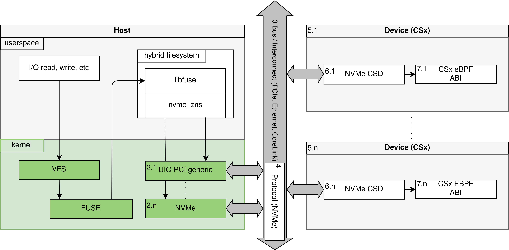
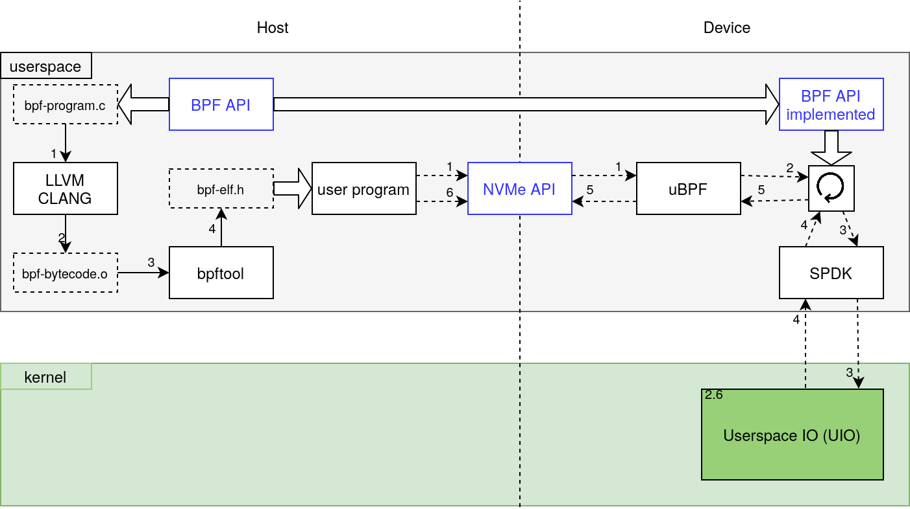

[](https://gitlab.dantalion.nl/vu/qemu-csd/-/pipelines)
[](https://gitlab.dantalion.nl/vu/qemu-csd/-/jobs/artifacts/master/download?job=coverage)
[](https://gitlab.dantalion.nl/vu/qemu-csd/-/commits/master)
[](https://gitlab.dantalion.nl/vu/qemu-csd/-/blob/master/LICENSE)
[](https://twitter.com/D4ntali0n)

# Publications

* arXiv, 13 December 2021 - [Past, Present and Future of Computational Storage: A Survey](https://arxiv.org/abs/2112.09691)
* arXiv, 29 November 2021 - [ZCSD: a Computational Storage Device over Zoned Namespaces (ZNS) SSDs](https://arxiv.org/abs/2112.00142)

**on-going / pending**

* thesis - [OpenCSD: LFS enabled Computational Storage Device over Zoned Namespaces (ZNS) SSDs](https://gitlab.dantalion.nl/vu/qemu-csd/-/jobs/artifacts/master/download?job=build-documentation)

# OpenCSD

OpenCSD is an improved version of ZCSD achieving snapshot consistency
log-structured filesystem (LFS) (FluffleFS) integration on Zoned Namespaces
(ZNS) Computational Storage Devices (CSD). Below is a diagram of the overall
architecture as presented to the end user. However, the actual implementation
differs due to the use of emulation using technologies such as QEMU, uBPF and
SPDK.



# ZCSD

ZCSD is a full stack prototype to execute eBPF programs as if they are
running on a ZNS CSD SSDs. The entire prototype can be run from userspace by
utilizing existing technologies such as SPDK and uBPF. Since consumer ZNS SSDs
are still unavailable, QEMU can be used to create a virtual ZNS SSD. The
programming and interactive steps of individual components is shown below.



## Getting Started

The getting started & examples are actively being reworked to be easier to
follow and a lower barrier to entry. The [Setup](#setup) section should still be
complete but alternatively [the old readme of the ZCSD prototype is still
readily available](zcsd/README.md).

[](https://asciinema.org/a/zoM9ncLUTO4QIqntblHKNOEtC)

### Index

* [Directory structure](#directory-structure)
* [Modules](#modules)
* [Dependencies](#dependencies)
* [Setup](#setup)
* [Examples](#examples)
* [Contributing](#contributing)
  * [CMake Configuration](#cmake-configuration)
* [Licensing](#licensing)
* [References](#references)
* [Progress Report](#progress-report)
* [Logbook](#logbook)

### Directory Structure

* qemu-csd - Project source files
* cmake - Small cmake snippets to enable various features
* dependencies - Project dependencies
* docs - Doxygen generated source code documentation
* [playground]([playground/README.md]) - Small toy examples or other
  experiments
* [python](python/README.md) - Python scripts to aid in visualization or
  measurements
* [scripts](scripts/README.md) - Shell scripts primarily used by CMake to
  install project dependencies
* tests - Unit tests and possibly integration tests
* thesis - Thesis written on OpenCSD using LaTeX
* [zcsd](zcsd/README.md) - Documentation on the previous prototype.
  * compsys 2021 - CompSys 2021 presentation written in LaTeX
  * documentation - Individual Systems Project report written in LaTeX
  * presentation - Individual Systems Project midterm presentation written in
  LaTeX
* .vscode - Launch targets and settings to debug programs running inside QEMU
  over SSH

### Modules

| Module          | Task                                                             |
|-----------------|------------------------------------------------------------------|
| arguments       | Parse commandline arguments to relevant components               |
| bpf_helpers     | Headers to define functions available from within BPF            |
| bpf_programs    | BPF programs ready to run on a CSD using bpf_helpers             |
| fuse_lfs        | Log Structured Filesystem in FUSE                                |
| nvme_csd        | Emulated additional NVMe commands to enable BPF CSDs             |
| nvme_zns        | Interface to handle zoned I/O using abstracted backends          |
| nvme_zns_memory | Non-persistent memory backed emulated ZNS SSD backend            |
| nvme_zns_spdk   | Persistent SPDK backed ZNS SSD backend                           |
| output          | Neatly control messages to stdout and stderr with levels         |
| spdk_init       | Provides SPDK initialization and handles for nvme_zns & nvme_csd |

### Dependencies

This project has a large selection of dependencies as shown below. Note however,
**these dependencies are already available in the image QEMU base image**.

**Warning** Meson must be below version 0.60 due to
[a bug in DPDK](https://bugs.dpdk.org/show_bug.cgi?id=836)

* General
    * Linux 5.5 or higher
    * compiler with c++17 support
    * clang 10 or higher
    * cmake 3.18 or higher
    * python 3.x
    * mesonbuild < 0.60 (`pip3 install meson==0.59`)
    * pyelftools (`pip3 install pyelftools`)
    * ninja
    * cunit
* Documentation
    * doxygen
    * LaTeX
* Code Coverage
    * ctest
    * lcov
    * gcov
    * gcovr
* Continuous Integration
    * valgrind
* Python scripts
    * virtualenv

The following dependencies are automatically compiled and installed into the
build directory.

| Dependency                                                       | System   | Version                                                                                                         |
|------------------------------------------------------------------|----------|-----------------------------------------------------------------------------------------------------------------|
| [backward](https://github.com/bombela/backward-cpp)              | ZCSD     | 1.6                                                                                                             |
| [booost](https://www.boost.org/)                                 | ZCSD     | 1.74.0                                                                                                          |
| [bpftool](https://github.com/Netronome/bpf-tool)                 | ZCSD     | 5.14                                                                                                            |
| [bpf_load](https://github.com/Netronome/bpf-tool)                | ZCSD     | [5.10](https://elixir.bootlin.com/linux/v5.10.77/source/samples/bpf/bpf_load.h)                                 |
| [dpdk](https://www.dpdk.org/)                                    | ZCSD     | spdk-21.11                                                                                                      |
| [generic-ebpf](https://github.com/generic-ebpf/generic-ebpf)     | ZCSD     | [c9cee73](https://github.com/generic-ebpf/generic-ebpf/commit/c9cee73c73845c9d60aef807b7ee7891987cd6fd)         |
| [fuse-lfs](https://github.com/sphurti/Log-Structured-Filesystem) | OpenCSD  | [526454b](https://github.com/sphurti/Log-Structured-Filesystem/commit/526454b99102d4e8875898550f92d577bbbb8ca2) |
| [libbpf](https://github.com/libbpf/libbpf)                       | ZCSD     | 0.5                                                                                                             |
| [libfuse](https://github.com/libfuse/libfuse)                    | OpenCSD  | 3.10.5                                                                                                          |
| [libbpf-bootstrap](https://github.com/libbpf/libbpf)             | ZCSD     | [67a29e5](https://github.com/libbpf/libbpf-bootstrap/commit/67a29e511cc9d0a570d4d3b9797827f3a08ccdb5)           |
| [linux](https://www.kernel.org/)                                 | ZCSD     | 5.14                                                                                                            |
| [spdk](https://github.com/spdk/spdk)                             | ZCSD     | 22.01                                                                                                           |
| [isa-l](https://github.com/intel/isa-l)                          | ZCSD     | spdk-v2.30.0                                                                                                    |
| [rocksdb](https://github.com/facebook/rocksdb)                   | OpenCSD  | 6.25.3                                                                                                          |
| [qemu](https://www.qemu.org/)                                    | ZCSD     | 6.1.0                                                                                                           |
| [uBPF](https://github.com/iovisor/ubpf)                          | ZCSD     | [9eb26b4](https://github.com/iovisor/ubpf/commit/9eb26b4bfdec6cafbf629a056155363f12cec972)                      |
| [xenium](https://github.com/mpoeter/xenium/)                     | OpenCSD  | [f1d28d0](https://github.com/mpoeter/xenium/commit/f1d28d0980cf2128c3f6b77d321aad5ca469dbce)                    |

### Setup

The project requires between 15 and 30 GB of disc space depending on
your configuration. While there are no particular system memory or performance
requirements for running OpenCSD, debugging requires between 10 and 16 GB of
reserved system memory. The table shown below explains the differences between
the  possible configurations and their requirements.

| Storage Mode   | Debugging | Disc space | System Memory | Cmake Parameters                                               |
|----------------|-----------|------------|---------------|----------------------------------------------------------------|
| Non-persistent | No        | 15 GB      | < 2 GB        | -DCMAKE_BUILD_TYPE=Release -DIS_DEPLOYED=on -DENABLE_TESTS=off |                                
| Non-persisten  | Yes       | 15 GB      | 13 GB         | -DCMAKE_BUILD_TYPE=Debug -DIS_DEPLOYED=on                      |
| Persistent     | No        | 30 GB      | 10 GB         | -DCMAKE_BUILD_TYPE=Release -DENABLE_TESTS=off                  |
| Persistent     | Yes       | 30 GB      | 16 GB         | default                                                        |

OpenCSD its initial configuration and compilation must be performed prior to
its use. After checking out the OpenCSD repository this can be achieved by
executing the commands shown below. Each section of individual commands must be
executed from the root of the project directory.

```shell script
git submodule update --init
mkdir build
cd build
cmake .. # For non default configurations copy the cmake parameters before the ..
cmake --build .
# Do not use make -j $(nproc), CMake is not able to solve concurrent dependency chain
cmake .. # this prevents re-compiling dependencies on every next make command
```

```shell script
cd build/qemu-csd
source activate
qemu-img create -f raw znsssd.img 16777216 # 34359738368
# By default qemu will use 4 CPU cores and 8GB of memory
./qemu-start.sh
# Wait for QEMU VM to fully boot... (might take some time)
git bundle create deploy.git HEAD
rsync -avz -e "ssh -p 7777" deploy.git arch@localhost:~/
# Type password (arch)
ssh arch@localhost -p 7777
# Type password (arch)
git clone deploy.git qemu-csd
rm deploy.git
cd qemu-csd
git -c submodule."dependencies/qemu".update=none submodule update --init
mkdir build
cd build
cmake -DENABLE_DOCUMENTATION=off -DIS_DEPLOYED=on ..
# Do not use make -j $(nproc), CMake is not able to solve concurrent dependency chain
cmake --build .
```

```shell script
git remote set-url origin git@github.com:Dantali0n/qemu-csd.git
ssh-keygen -t rsa -b 4096
eval $(ssh-agent) # must be done after each login
ssh-add ~/.ssh/NAME_OF_KEY
```

```shell script
virtualenv -p python3 python
cd python
source bin/activate
pip install -r requirements.txt
```

### Running & Debugging

Running and debugging programs is an essential part of development. Often,
barrier to entry and clumsy development procedures can severely hinder
productivity. Qemu-csd comes with a variety of scripts preconfigured to reduce
this initial barrier and enable quick development iterations.

#### Environment:
Within the build folder will be a `qemu-csd/activate` script. This script can be
sourced using any shell `source qemu-csd/activate`. This script configures
environment variables such as `LD_LIBRARY_PATH` while also exposing an essential
sudo alias: `ld-sudo`.

The environment variables ensure any linked libraries can be found for targets
compiled by Cmake. Additionally, `ld-sudo` provides a mechanism to start targets
with  sudo privileges while retaining these environment variables. The
environment can be deactivated at any time by executing `deactivate`.

#### Usage Examples:

TODO: Generate integer data file, describe qemucsd and spdk-native applications,
usage parameters, relevant code segments to write your own BPF program, relevant
code segments to extend the prototype.

#### Debugging on host:
For debugging, several mechanisms are put in place to simplify this process.
Firstly, vscode launch files are created to debug applications even though the
require environmental configuration. Any application can be launched using the
following set of commands:

```shell
source qemu-csd/activate
# For when the target does not require sudo
gdbserver localhost:2222 playground/play-boost-locale
# For when the target requires sudo privileges
ld-sudo gdbserver localhost:2222 playground/play-spdk
```

Note, that when QEMU is running the port _2222_ will be used by QEMU instead.
The launch targets in `.vscode/launch.json` can be easily modified or extended.

When gdbserver is running simply open vscode and select the root folder of
qemu-csd, navigate to the source files of interest and set breakpoints and
select the launch target from the dropdown (top left). The debugging panel in
vscode can be accessed quickly by pressing _ctrl+shift+d_.

Alternative debugging methods such as using gdb TUI or
[gdbgui](https://www.gdbgui.com/) should work but will require more manual
setup.

#### Debugging on QEMU:
Debugging on QEMU is similar but uses different launch targets in vscode. This
target automatically logs-in using SSH and forwards the gdbserver connection.

More native debugging sessions are also supported. Simply login to QEMU and
start the gdbserver manually. On the host connect to this gdbserver and set up
`substitute-path`.

On QEMU:
```shell
# from the root of the project folder.
cd  build
source qemu-csd/activate
ld-sudo gdbserver localhost:2000 playground/play-spdk
```

On host:
```shell
gdb
target remote localhost:2222
set substitute-path /home/arch/qemu-csd/ /path/to/root/of/project
```

More detailed information about development & debugging for this project can be
found in the report.

#### Debugging FUSE:

Debugging FUSE filesystem operations can be done through the compiled filesystem
binaries by adding the `-f` argument. This argument will keep the FUSE
filesystem process in the foreground.

```bash
gdb ./filesystem
b ...
run -f mountpoint
```

### Contributing

#### CMake Configuration

This section documents all configuration parameters that the CMake project
exposes and how they influence the project. For more information about the
CMake project see the report generated from the documentation folder. Below 
all parameters are listed along their default value and a brief description.

| Parameter            | Default | Use case                                         |
|----------------------|---------|--------------------------------------------------|
| ENABLE_TESTS         | ON      | Enables unit tests and adds tests target         |
| ENABLE_CODECOV       | OFF     | Produce code coverage report \w unit tests       |
| ENABLE_DOCUMENTATION | ON      | Produce code documentation using doxygen & LaTeX |
| ENABLE_PLAYGROUND    | OFF     | Enables playground targets                       |
| ENABLE_LEAK_TESTS    | OFF     | Add compile parameter for address sanitizer      |
| IS_DEPLOYED          | OFF     | Indicate that CMake project is deployed in QEMU  |

For several parameters a more in depth explanation is required, primarily
_IS_DEPLOYED_. This parameter is used as the Cmake project is both used to
compile QEMU and configure it as well as compile binaries to run inside QEMU. As
a results, the CMake project needs to be able to identify if it is being
executed outside of QEMU or not. This is what _IS_DEPLOYED_ facilitates.
Particularly, _IS_DEPLOYED_ prevents the compilation of QEMU from source.

### Licensing

This project is available under the MIT license, several limitations apply
including:
  
* Source files with an alternative author or license statement other than Dantali0n and MIT respectively.
* Images subject to copyright or usage terms, such the VU and UvA logo.
* CERN beamer template files by Jerome Belleman.
* Configuration files that can't be subject to licensing such as `doxygen.cnf`
  or `.vscode/launch.json`

### References

* ZNS
  * [Zoned storage ZNS SSDs introduction](https://zonedstorage.io/introduction/zns/)
  * [Getting started with ZNS in QEMU](https://www.snia.org/educational-library/getting-started-nvme-zns-qemu-2020)
  * [NVMe ZNS command set 1.0 ratified TP](https://nvmexpress.org/wp-content/uploads/NVM-Express-1.4-Ratified-TPs-1.zip)
  * [libnvme presentation](https://www.usenix.org/sites/default/files/conference/protected-files/vault20_slides_busch.pdf)
  * [dm-zap conventional zones for ZNS](https://github.com/westerndigitalcorporation/dm-zap)
  * [FEMU accurate NVMe SSD Emulator](https://github.com/ucare-uchicago/FEMU)
* Filesystems
  * [Linux Inode](https://man7.org/linux/man-pages/man7/inode.7.html)
  * Filesystem Benchmarks
    * [Filebench](https://github.com/filebench/filebench)
    * [Filebench Tutorial](http://www.nfsv4bat.org/Documents/nasconf/2005/mcdougall.pdf)
* FUSE
  * [To FUSE or Not to FUSE: Performance of User-Space File Systems](http://libfuse.github.io/doxygen/fast17-vangoor.pdf)
  * [FUSE kermel documentation](https://www.kernel.org/doc/html/latest/filesystems/fuse.html)
  * [FUSE forget](https://fuse-devel.narkive.com/SMANJULN/when-does-fuse-forget)
  * Other FUSE3 filesystems that can be used for reference
    * [MergerFS](https://github.com/trapexit/mergerfs/tree/master/src)
* LFS
  * [f2fs usenix paper](https://www.usenix.org/system/files/conference/fast15/fast15-paper-lee.pdf)
  * [f2fs kernel documentation](https://www.kernel.org/doc/html/latest/filesystems/f2fs.html)
* BPF
  * Linux Kernel related
    * [Linux bpf manpage](https://www.man7.org/linux/man-pages/man2/bpf.2.html)
    * [BPF kernel documentation](https://www.kernel.org/doc/Documentation/networking/filter.txt)
  * BPF-CO-RE & BTF
    * [Linux BTF documentation](https://www.kernel.org/doc/html/latest/bpf/btf.html)
    * [BPF portability and CO-RE](https://facebookmicrosites.github.io/bpf/blog/2020/02/19/bpf-portability-and-co-re.html)  **Highly Recommended Read**
  * libbpf / standalone related
    * [BCC to libbpf conversion](https://facebookmicrosites.github.io/bpf/blog/2020/02/20/bcc-to-libbpf-howto-guide.html)
    * [Cilium BPF + XDP reference guide](https://docs.cilium.io/en/v1.9/bpf/) **Highly Recommended Read**
    * bpf_load
      * [Linux Observability with BPF](https://www.oreilly.com/library/view/linux-observability-with/9781492050193/)
    * bpf-bootstrap
      * [Building BPF applications with libbpf-bootstrap](https://nakryiko.com/posts/libbpf-bootstrap/)
  * Userspace BPF execution / interpretation
    * [uBPF](https://github.com/iovisor/ubpf)
    * [iomartin uBPF patch expose registers](https://github.com/iomartin/ubpf/commit/ca1ad94613a01e1fa5cc04d43c73acc6b5074881)
    * [iomartin uBPF patch relocation type](https://github.com/iomartin/ubpf/commit/af4a54c201524f975137d8c531dfef82010b65cd)
    * [generic-ebpf](https://github.com/generic-ebpf/generic-ebpf)
  * Verifiers
    * [PREVAIL](https://github.com/vbpf/ebpf-verifier)
  * Hardware implementations
    * [hBPF](https://github.com/rprinz08/hBPF)
  * Various
    * [BTF sysfs vmlinux ABI](https://www.kernel.org/doc/Documentation/ABI/testing/sysfs-kernel-btf)
    * [BPF features and minimal kernel versions](https://github.com/iovisor/bcc/blob/master/docs/kernel-versions.md)
    * [BPF Performance Tools (Chapters 1, 2, 17.1, 17.5, 18)](http://www.brendangregg.com/bpf-performance-tools-book.html)
    * [eBPF release artile lwn.net](https://lwn.net/Articles/603983/)
    * [Why pingCAP switched from BCC to libbpf](https://pingcap.com/blog/why-we-switched-from-bcc-to-libbpf-for-linux-bpf-performance-analysis)
* Repositories / Libraries
  * [uNVME](https://github.com/OpenMPDK/uNVMe)
  * [SPDK](https://github.com/spdk/spdk)
* Patchsets
  * [ZNS SSD QEMU patch v11](http://patchwork.ozlabs.org/project/qemu-devel/list/?series=219344)
  * [ZNS SSD QEMU patch v2](https://patchwork.kernel.org/project/qemu-devel/cover/20200617213415.22417-1-dmitry.fomichev@wdc.com/)

### Progress Report

- Week 1 -> Goal: get fuse-lfs working with libfuse
  - [X] Add libfuse, fuse-lfs and rocksdb as dependencies
  - [X] Create custom libfuse fork to support non-privileged installation
  - [X] Configure CMake to install libfuse
  - [X] Configure environment script to setup pkg-config path
  - [X] Use Docker in Docker (dind) to build docker image for Gitlab CI pipeline
  - [X] Investigate and document how to debug fuse filesystems
  - [X] Determine and document RocksDB required syscalls
  - [X] Setup persistent memory that can be shared across processes
    - [ ] Split into daemon and client modes
- Week 2 -> Goal get a working LFS filesystem
  - [X] Create solid digital logbook to track discussions
- Week 3 -> Investigate FUSE I/O calls and fadvise
  - [ ] Get a working LFS filesystem using FUSE
    - [ ] What are the requirements for these filesystems.
    - [X] Create FUSE LFS path to inode function.
      - [X] Test path to inode function using unit tests.
  - [X] Setup research questions in thesis.
  - [ ] Run filesystem benchmarks with strace
    - [ ] RocksDB DBBench
    - [ ] Filebench
  - [X] Use fsetxattr for 'process' attributes in FUSE
    - [X] Document how this can enable CSD functionality in regular filesystems
- Week 4 -> FUSE LFS filesystem
  - [ ] Get a working LFS filesystem using FUSE
    - [ ] What are the requirements for these filesystems? (research question)
      - [ ] Snapshots
      - [ ] GC
  - [X] Test path to inode function using unit tests.
- Week 5 -> FUSE LFS filesystem
  - [ ] Get a working LFS filesystem using FUSE
    - [ ] Filesystem considerations for fair testing against proven filesystems
      - [ ] _fsync_ must actually flush to disc.
      - [ ] In memory caching is only allowed if filesystem can recover to a
        stable state upon crash or power loss.
    - [ ] Filesystem considerations to achieve functionality
      - [ ] Upon initialization all directory / filename and inode relations are
        restored from disc and stored in memory. These datastructures
        utilize maps as the lookup is `log(n)`.
      - [ ] Periodically all changes are flushed to disc (every 5 seconds).
      - [ ] Use bitmaps to determine occupied sectors.
      - [ ] Snapshots are memory backed and remain as long as the file is open.
        - [ ] GC needs to check both open snapshot sectors and occupied sector
          bitmap.
      - [ ] GC uses two modes
        - [ ] (foreground) blocking if there is no more drive space to perform
          the append.
        - [ ] (background) periodic to clear entirely unoccupied zones.
        - [X] Reserve last two zones from total space for GC operations.
- Week 6 -> FUSE LFS filesystem
  - [ ] Get a working LFS filesystem using FUSE
    - [X] Filesystem constraints / limitations
      - [X] No power atomicity
    - [X] Test path to inode function using unit tests.
    - [X] Test checkpoint functionality
    - [X] Write a nat block to the drive
      - [X] Function to append nat block
    - [ ] Write an inode block to the drive
      - [ ] Inode append function
    - [ ] Decide location of size and filename fields on disc
      - [ ] inode vs file / data block
  - [X] Account for zone capacity vs zone size differences
    - [X] Ensure lba_to_position and position_to_lba solve these gaps.
    - [ ] Configurable zone cap / zone size gap in NvmeZnsMemoryBackend
    - [X] Correctly determine zone cap / zone size gap in NvmeZnsSpdkBackend
- Week 7 -> FUSE LFS filesystem
  - [ ] Get a working LFS filesystem using FUSE
    - [ ] Write an inode block to the drive
      - [ ] Inode append function
    - [ ] Decide location of size and filename fields on disc
      - [ ] inode vs file / data block
- Week 8 -> FUSE LFS filesystem
  - [ ] Run filesystem benchmarks with strace
    - [ ] RocksDB DBBench
    - [ ] Filebench
- Week 10 -> FUSE LFS Filesystem
  - [X] Write inode block to drive
  - [X] Inode create / update / append
  - [X] Decide location of size and filename fields on disc
  - [X] Read file data from drive
  - [X] Write file data to drive
  - [ ] SIT block management for determining used sectors (use bitfields)
  - [ ] log_pos to artificially move the start of the log zone
        (same as random_pos)
  - [ ] Garbage collection & compaction
  - [ ] rename, unlink and rmdir
    - [ ] Callback interface using nlookup / forget to prevent premature firing
    - [ ] Temporary file duplication? for renamed files and directories
      - [ ] What if an open handle deletes the file / directory that has been
            renamed??
- Week 12 -> FUSE LFS Filesystem
  - [X] Implement statfs
  - [X] Implement truncate
  - [X] Implement CSD state management using extended attributes
  - [X] Implement in-memory snapshots
    - [ ] In-memory snapshots with write changes become persistent after the
          kernel finishes execution. The files use special filenames that are
          reserved to the filesystem (use filename + filehandle).
- Week 14 -> FUSE LFS Filesystem
  - [ ] Run DBBench & Filebench early benchmarks
- Week 16 -> FUSE LFS Filesystem
  - [ ] Optimizations, parallelism and queue depth > 1
    - [ ] Wrap all critical datastructures in wrapper classes that intrinsically
          manages locks (mutexes)
    - [ ] Figure out how SPDK can notify the caller of where the data was
          written
- Week 18
- Week 20
- Week 22
- Week 24
- Week 26
- Week 28
- Week 30
- Week 32
- Week 34
- Week 36

### Logbook

Serves as a place to quickly store digital information until it can be refined
and processed into the master thesis.

- [Discussion Notes](#discussion-notes)
- [Research Questions](#research-questions)
- [Correlation POSIX and FUSE](#correlation-posix-and-fuse)
- [RocksDB Integration](#rocksdb-integration)
- [Fuse LFS Design](#fuse-lfs-design)
  - [Requirements](#requirements)
  - [Design Limitations](#limitations-and-potential-improvements)
  - [Non-persistent Conditional Extended Attributes in FUSE](#non-persistent-conditional-extended-attributes-in-FUSE)

#### Discussion Notes

- In order to analyze the exact calls RocksDB makes during its benchmarks tools
  like `strace` can be used.
- Several methods exist to prototype filesystem integration for CSDs. Among
  these are using LD_PRELOAD to override system calls such as read(), write()
  and open(). In this design we choose to use FUSE as this simplifies some of
  the management and opens the possibility of allowing parallelism while the
  interface between FUSE and the filesystem calls is still thin enough it can be
  correlated.
- The filesystem can use a snapshot concurrency model with reference counts.
- Each file can maintain a special table that associates system calls with CSD
  kernels. To isolate this behavior (to specific users) we can use filehandles
  and process IDs (These should be available for most FUSE API calls anyway).
- The design should reuse existing operating system interfaces as much as
  possible. Any new API or call should be well motivated with solid arguments.
  As an initial idea we can investigate reusing POSIX fadvise.
- As requirements our FUSE LFS requires gc and snapshots. It would be nice to
  have parallelism.
- Crossing kernel and userspace boundaries can be achieved using ioctl should
  the need arise.
- As experiment for evaluation we should try to run RocksDB benchmarks on top
  of the FUSE LFS filesystem while offloading bloom filter computations from SST
  tables
- Filebench benchmark to identify filesystems calls. db_bench from RocksDB, run
  both with strace

#### Research questions

- Filesystem design and CSD requirements, why FUSE, why build from scratch
- FUSE, is it enough? filesystem calls, does the API support what we need.
  Research question.
- How does it perform compared to other filesystems / solutions
  - Characteristics to proof
    - Data reduction
    - Simplicity of algorithms (BPF) vs 'vanilla'
    - Performance (static analysis of no. of clock cycles using LLVM-MCA)
  - Experiments
    - Write append in separate process and CSD averaging of file.

#### Correlation POSIX and FUSE

For convenience and reasonings sake a map between common POSIX I/O and FUSE API
calls is needed.

POSIX

- close
- (p/w)read
- (p/w)write
- lseek
- open
- fcntl
- readdir
- posix_fadvise

FUSE

- getattr
- readdir
- open
- create
- read
- write
- unlink
- statfs

#### RocksDB Integration

Required syscalls, by analysis of
https://github.com/facebook/rocksdb/blob/7743f033b17bf3e0ea338bc6751b28adcc8dc559/env/io_posix.cc

- clearerr (stdio.h)
- close (unistd.h)
- fclose (stdio.h)
- feof (stdio.h)
- ferror (stdio.h)
- fread_unlocked (stdio.h)
- fseek (stdio.h)
- fstat (sys/stat.h)
- fstatfs (sys/statfs.h / sys/vfs.h)
- ioctl (sys/ioctl.h)
- major (sys/sysmacros.h)
- open (fcntl.h)
- posix_fadvise (fcntl.h)
- pread (unistd.h)
- pwrite (unistd.h)
- readahead (fcntl.h + _GNU_SOURCE)
- realpath (stdlib.h)
- sync_file_range (fcntl.h + _GNU_SOURCE)
- write (unistd.h)

Potential issues:
- Use of IOCTL
- Use of IO_URING

### Fuse LFS Design

Filesystem design and architecture is continuously improving and being modified
see source files such as `fuse_lfs_disc.hpp` until design is frozen.

#### Requirements

- Log-structured
- Persistent
- Directories / files with names up to 480 bytes
- File / directory renaming
- In memory snapshots
- Garbage Collection (GC)
- Non-persistent conditional extended attributes
- _fsync_ must actually flush to disc
- In memory caching is only allowed if filesystem can recover to a valid state

#### Limitations and Potential Improvements

- data_position struct and its validity and comparisons being controlled by
  their size property is clunky and counterintuitive.
- random zone can only be rewritten once it is completely full.
- compaction is only performed upon garbage collection, initial writes might use
  only partially filled data blocks.
- A kernel _CAN NOT_ return more data than the snapshotted size of
  the file it is reading.
- A kernel _CAN NOT_ return more data than is specified in the read request.
- A race condition in update_file_handle can potentially remove other unrelated
  file handles from open_inode_vect.
- Since invalidating FUSE internal caches depends on lookup / getattr their
  modification time; Reading a file regularly, setting the extended attributes
  and then reading the file again to get a snapshotted read will result in the
  read becoming a regular read if all these operations are performed within the
  same second. Mtime is Hjiacked to have modification times of regular files
  life in the past to circumvent this. See `FLFS_FAKE_MTIME` and `ino_fake_mtime`
  in the fuse_lfs module.

#### Threading and Concurrency

- Parallelism is managed through coarse grained locking.
  - Almost all FUSE operations are subject to lock a rwlock in either read or
    write mode. Operations requiring exclusive locking such as create / mkdir
    and fsync take the writers lock. While open / readdir / write / read and
    truncate take the readers lock. Some FUSE operations might be able to
    operate lockless such as statfs
  - Any operations regarding a particular inode must first obtain a lock for
    this inode.
    - Once it is determined a read or write operation will be performed on
      a snapshot the inode lock should be released.
    - A potential optimizations is to have read / write check for snapshot
      before any other operation, only grabbing the lock if necessary.
  - All individual datastructures are protected using reader writer locks with
    writer preference.

#### Beyond Queue Depth 1 / Concurrent Reads / Writes

- Have the SPDK backend create a qpair for every unique thread id it encounters
  `std::this_thread::get_id()` strongly binding this new qpair to the id. Each
  I/O request from this thread id is only queued to this qpair.
- Having concurrent appends will cause some appends to fail due to the zone
  being full. The SPDK backend will raise an error in this case and functions
  in FluffleFS must be tuned to handle this, Primarily log_append.

#### Non-persistent Conditional Extended Attributes in FUSE

Extended filesystem attributes support various namespaces with different
behavior and responsibility. Since the underlying filesystem is still tasked
with storing these attributes persistently regardless of namespace, the FUSE
filesystem is effectively in full control on how to process these calls.

Given the already existing standard to use namespaces for permissions, roles and
behavior an additional namespace is an easy and clean extension. Introducing
the _process_ namespace. Non-persistent extended file attributes that are only
visible to the process that created them. Effectively an in memory map that
lives inside the filesystem instead of in the calling process.

The state of these extended attributes is managed through the use of
`fuse_req_ctx` which can determine the callers pid, gid and uid for all FUSE
hooks except release / releasedir. To combat this limitation FluffleFS generates
a unique  filehandle for each open file. The pid is only used at the moment the
first extended attribute is set.

#### Circumventing Return Data Limitations

Circumventing return data can be achieved by using
`FUSE_CAP_EXPLICIT_INVAL_DATA` and `fuse_lowlevel_notify_inval_inode` but this
requires a major overhaul because the call to `fuse_lowlevel_notify_inval_inode`
must be performed manually throughout the entire code base.

The alternative is by enabling `FUSE_CAP_AUTO_INVAL_DATA` (as is already the
case) and ensuring the size returned by `getattr` is sufficient for the return
data. In addition `struct stat` their timeout parameters need to be sufficiently
low such that the request is invalid by the time the next one comes in (so 0).
The problem with this is `getattr` is called before the kernel is run so the
size of the return data is still unknown.

#### Kernel Execution and Safety

Several safety mechanisms are necessary during the execution of the user
provided kernels. The static assertion, using tools such as ebpf-verifier, is
limited due to the requirement to populate datastructures from vm calls at
runtime.

Safety mechanisms must be provided at runtime by vm. However, these safety
mechanisms can not rely on realtime filesystem information as they are running
on the CSD. Possible solutions fall into two categories:

- Device level
  - A min and maximum range of acceptable LBAs to operate on can be provided
    alongside the submission of the user provided kernel. Should any request
    fall outside this range the execution would be terminated and the error
    would be returned to the caller (in reality this would require NVMe
    completion status commands or similar).
- Host level
  - The device keeps tracks of the operations and on which LBA these are
    performed. Essentially two vectors of read and written LBAs. Upon completion
    of the kernel this information would be made available to the filesystem.
    The filesystem then decides if the execution was malicious or genuine.

Limitations:
 - Both of these protections do not prevent against infinite loops.
 - While this does not protect against arbitrary code execution it does protect
   against overwriting any preexisting data due to lack of access to the NVMe
   reset command.

A combination of both host and device level protections seems appropriate. This
will incur an additional runtime cost. Potentially, the filesystem could have
a set of verified kernels it keeps internally that disable all these runtime
checks.

#### Investigating read / write request limits

**References**

- https://lkml.iu.edu/hypermail/linux/kernel/1207.1/02414.html
- https://lkml.org/lkml/2012/7/5/136
- https://github.com/libfuse/libfuse/commit/4f8f034a8969a48f210bf00be78a67cfb6964c72
- https://elixir.bootlin.com/linux/latest/source/fs/fuse/fuse_i.h#L36

**ftrace**

https://unix.stackexchange.com/questions/529529/why-is-the-size-of-my-io-requests-being-limited-to-about-512k

```
trace-cmd record -e syscalls -p function_graph -c -F ./fuse-entry -- -d -o max_read=2147483647 test
```

```
sudo trace-cmd record -e syscalls -p function_graph -l 'fuse_*'
```

**sysfs**

```
/proc/sys/fs/pipe-max-size
```